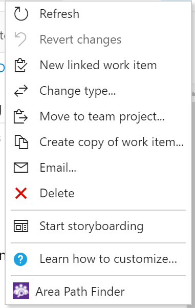

# Area Path Finder
Ever run into the problem where you know the name of a person on a team, but don't know what area path to move the work item to?  Area Path Finder solves this!  Simply enter the name of a team member and you will see all the area paths of the teams they belong to.

### How to use
Simply select the "Area Path Finder" menu item and enter the desired team member on the dialog box. 

### Feedback
For bugs please use the [issue tracker](https://github.com/sferg-msft/vsts-extension-wit-areapathfinder/issues) on the GitHub repo.

For feedback/questions contact me on Twitter: [@sferg_msft](https://twitter.com/sferg_msft).